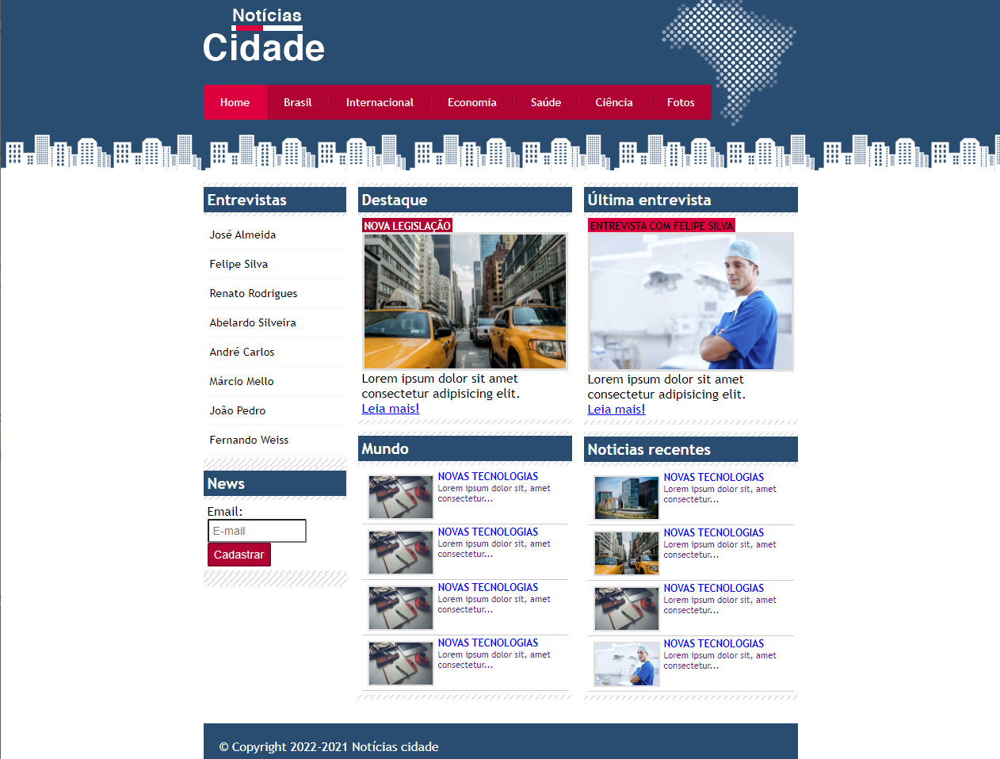
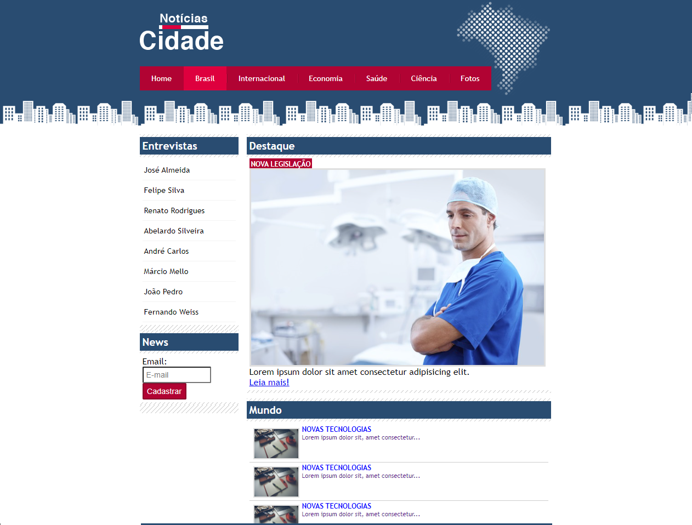

# Site Notícias Cidade
## Site voltado a apresetação de um site de notícias de uma cidade, onde apresenta o escopo da página que segue o padrão ultilizado pelos sites de notícias atuais.
<h1 align="center">
  
</h1>

 <a href="#sobre-o-projeto">Sobre</a> •
 <a href="#funcionalidades">Funcionalidades</a> •
 <a href="#layout">Layout</a> • 
 <a href="#tecnologias">Tecnologias</a> • 

<h4 align="center"> 
	 Notícias Cidade 📰 Finalizado
</h4>

## 📰Sobre o projeto

📰 Notícias Cidade foi um projeto desenvolvido durante o curso de Desenvolvimento Web ministrado pelo professor Jamilton Damasceno

Esse projeto foi desenvolvido para o estudo de implementação de conceitos básicos e boas práticas adotados na criação de páginas web abordando diversos temas de 
css partindo do conhecimento intermediário para o avançado como herança e especificidade, criação de barra de navegação lateral, navegação com abas, coluna falsa, 
imagens líquidas...
---

## ⚙Funcionalidades

-Basicamente o projeto consiste de apenas três páginas principais pois o fim é apenas didático e introdutório no html e css, sendo essas páginas o index, brasil e fotos:

  Página Index:
  
  Nesta página estava localizada as informações principais referente ao site de notícias, dividindo em três colunas, sendo a primeira a barra de navegação lateral, 
  na coluna do meio os destques e por fim na coluna a esquerda a última entrevista.
  
  
  
  Página Brasíl:
  
  Como o objetivo do projeto em si era trabalhar com colunas na segunda página denominada brasil foi realizado utilizando o mesmo escopo 
  da página index mas com apenas duas colunas, eliminado a coluna da esquerda.
  
  
  
  Página Fotos:

  Essa página simula como se o usúario tivesse clicado em algum link das noticias, onde o escopo da página de reduz para apenas uma coluna dando enfase apenas em uma notícia.
  
  
  ---

## 🎨Layout

O layout foi fornecido pelo professor do Jamilton Damasceno 
[Jamilton Damasceno](https://www.linkedin.com/in/jamiltondamasceno/) :

### 🛠Tecnologias

As seguintes ferramentas foram usadas na construção do projeto:

- [HTML](https://www.w3schools.com/html/default.asp)
- [CSS](https://www.w3schools.com/css/)
- [VisualStudio](https://visualstudio.microsoft.com/pt-br/)
